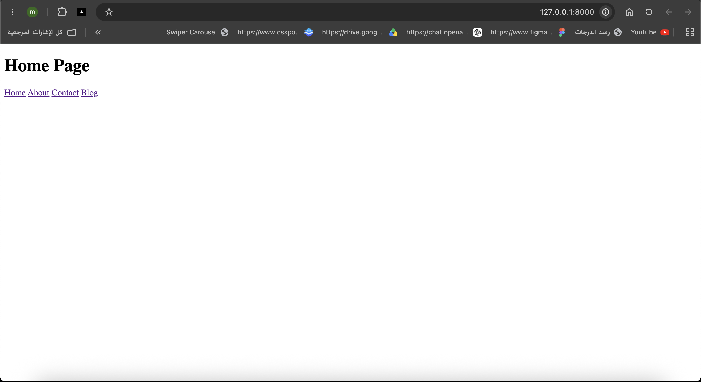
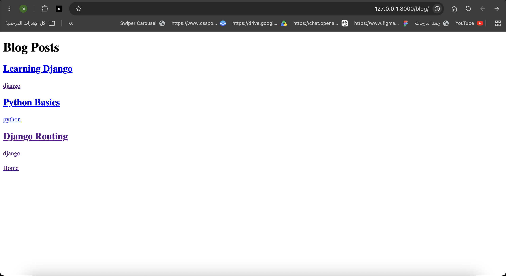
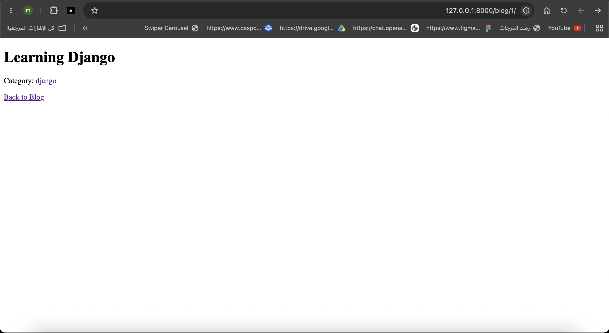
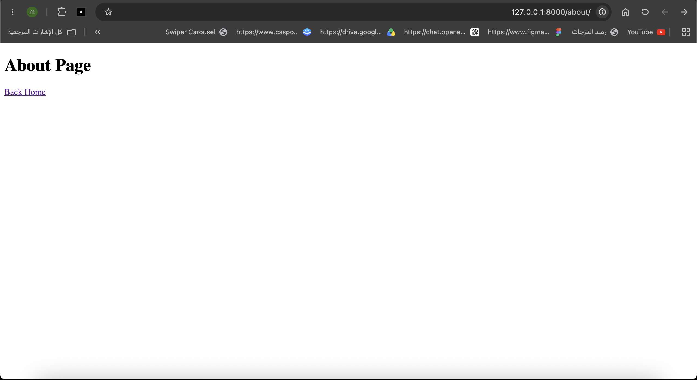
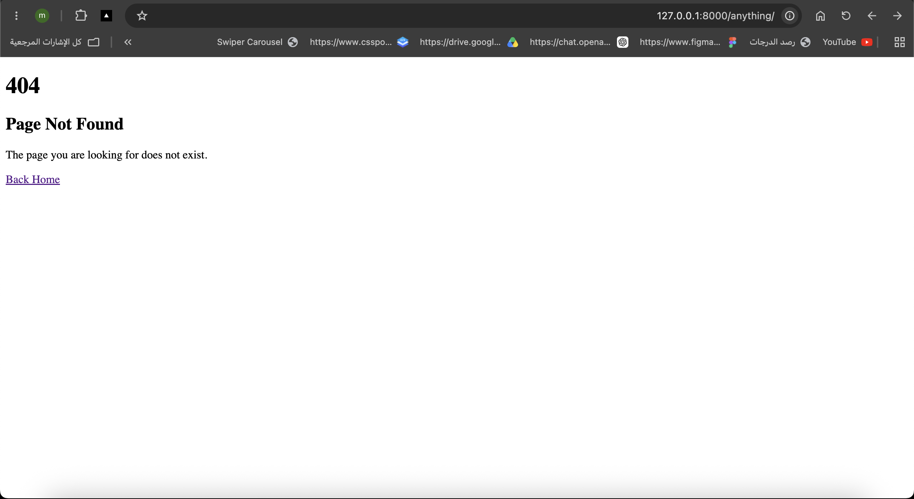

# Fully Modular Routing System

A Django project that demonstrates how to build a modular routing system using multiple apps, named URLs, namespaces, dynamic URL parameters, and custom error pages.

## Apps

The project contains multiple Django apps:

* `pages`
* `blog`
* `movie`

Each app has its own `urls.py` file to keep routing organized and separated.

## Pages App

The `pages` app contains:

* Home page
* About page
* Contact page

Routes:

```text
/
 /about/
 /contact/
```

The app uses the namespace:

```python
app_name = "pages"
```

Example template link:

```django

```

## Blog App

The `blog` app contains:

* Blog post list
* Blog post detail
* Blog posts by category

Routes:

```text
/blog/
/blog/<post_id>/
/blog/category/<category>/
```

Dynamic URL parameters are used for the post ID and category.

Example:

```text
/blog/1/
/blog/category/django/
```

The app uses the namespace:

```python
app_name = "blog"
```

Example template links:

```django



```

## Modular Routing

The main project `urls.py` uses `include()` to connect each app to its own routing file.

Example:

```python
path("", include("pages.urls")),
path("blog/", include("blog.urls")),
path("movies/", include("movie.urls")),
```

This keeps the project organized because each app is responsible for its own URLs.

## Named URLs and Namespaces

Named URLs are used instead of hard-coded URLs.

For example:

```python
path("about/", views.about, name="about")
```

Instead of writing:

```html
<a href="/about/">About</a>
```

the project uses:

```django
<a href="">About</a>
```

This makes the URLs easier to maintain and update.

## Dynamic URLs

Dynamic parameters allow the same route to handle different values.

Example:

```python
path("<int:post_id>/", views.post_detail, name="detail")
```

If the user visits:

```text
/blog/2/
```

Django sends:

```python
post_id = 2
```

to the view.

## Custom 404 Page

A custom `404.html` page is included to display a friendly message when the user visits a route that does not exist.

## URL Flow

The routing flow is:

```text
Browser
   ↓
Project urls.py
   ↓
include()
   ↓
App urls.py
   ↓
URL Pattern
   ↓
View
   ↓
Template
   ↓
Response
```

## Project Structure

```text
project/
│
├── manage.py
├── templates/
│   └── 404.html
│
├── mysite/
│   ├── settings.py
│   └── urls.py
│
├── pages/
│   ├── urls.py
│   ├── views.py
│   └── templates/
│       └── pages/
│
├── blog/
│   ├── urls.py
│   ├── views.py
│   └── templates/
│       └── blog/
│
└── movie/
    ├── urls.py
    ├── views.py
    └── templates/
```

## Run the Project

```bash
python manage.py runserver
```

Then open:

```text
http://127.0.0.1:8000/
```

## Screenshots











