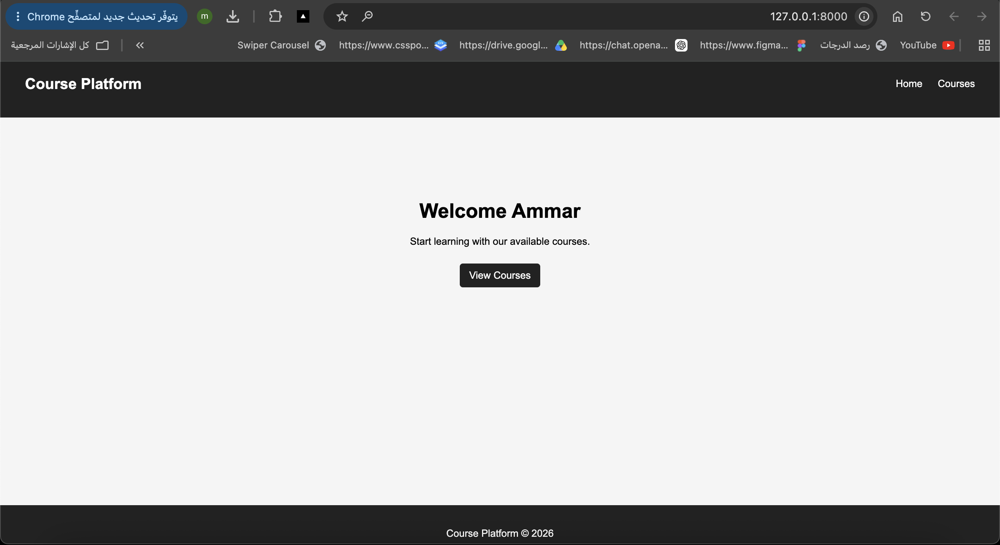
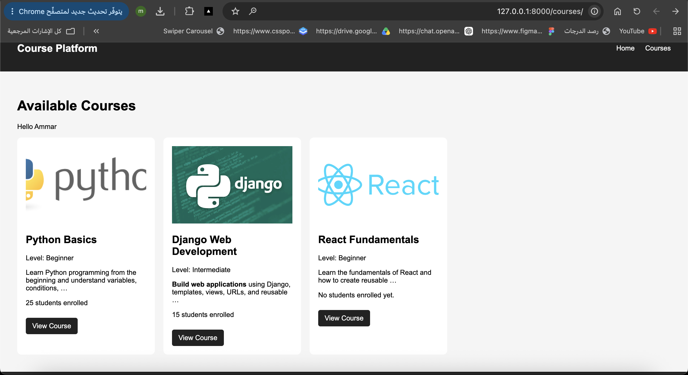
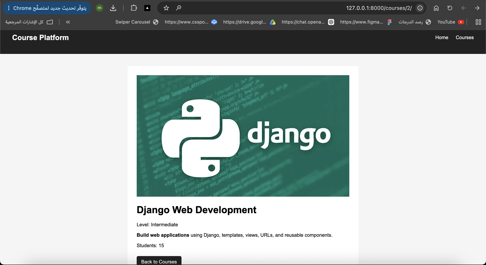

# Django Course Platform

A simple Django project that demonstrates template inheritance, reusable components, dynamic URLs, template filters, conditions, loops, and static files.

The project includes a Home page, Course List page, and dynamic Course Detail page. It uses `base.html` as the main reusable layout containing the navigation bar, footer, CSS link, and template blocks. Other pages extend the base template to avoid duplicated HTML and keep the layout consistent.

The Course List uses Django template loops and includes a reusable `course_card.html` component. Conditions are used to display different messages depending on the number of enrolled students, and `` is used when no courses are available.

Template filters such as `title`, `truncatewords`, and `safe` are also used to control how data is displayed. Navigation between pages uses Django named URLs with ``, while CSS and images are loaded using Django static files.

## Routes

- `/` - Home Page
- `/courses/` - Course List
- `/courses/<id>/` - Course Detail

## Concepts Used

- Template Inheritance
- `extends` and `block`
- Reusable Components with `include`
- Context
- `for` Loops
- `if` Conditions
- ``
- Template Filters
- Dynamic URLs
- Named URLs
- Static CSS and Images

## Screenshots

### Home Page


### Course List


### Course Detail


## Run the Project

```bash
python manage.py runserver