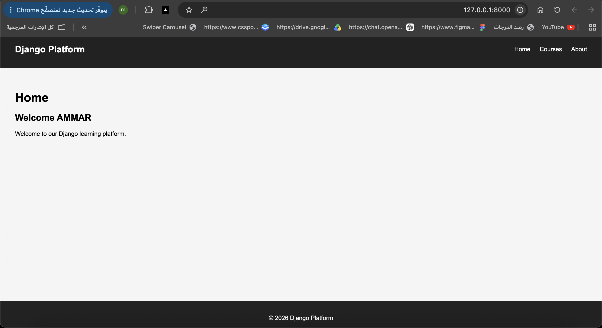
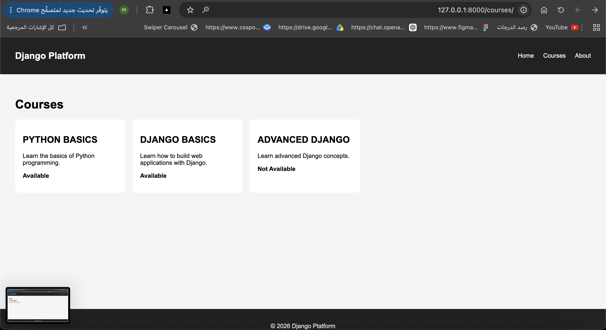
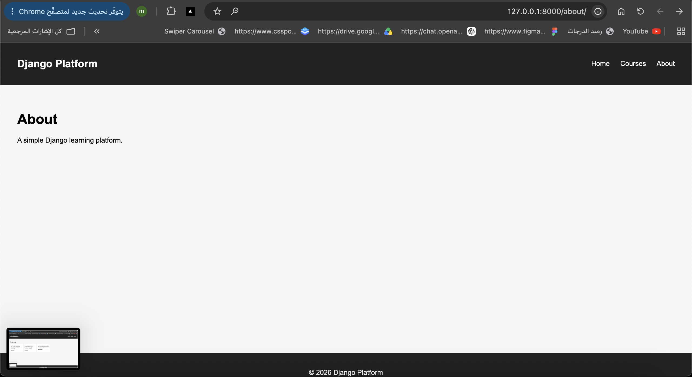

## Template Inheritance

The project uses `base.html` as the main reusable template.

The base template contains the navbar, footer, CSS link, and content blocks.
The Home, Courses, and About pages extend `base.html` and provide their own
content using Django template blocks.

This reduces duplicated HTML and keeps the layout consistent across all pages.

## Screenshots

### Home Page

### Courses Page

### About Page

