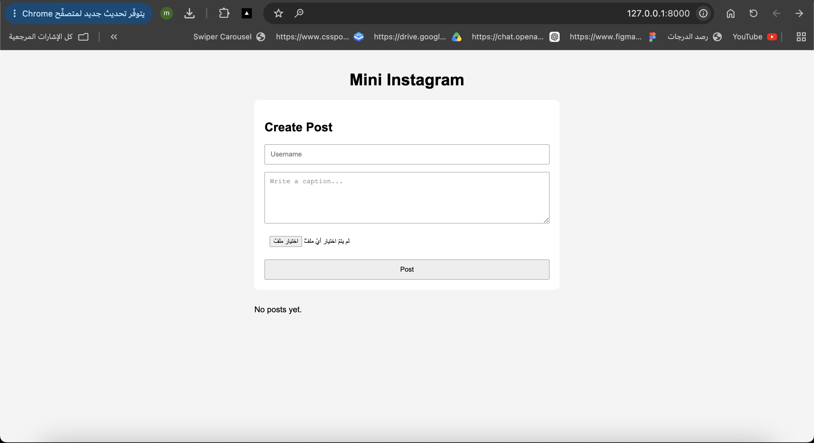
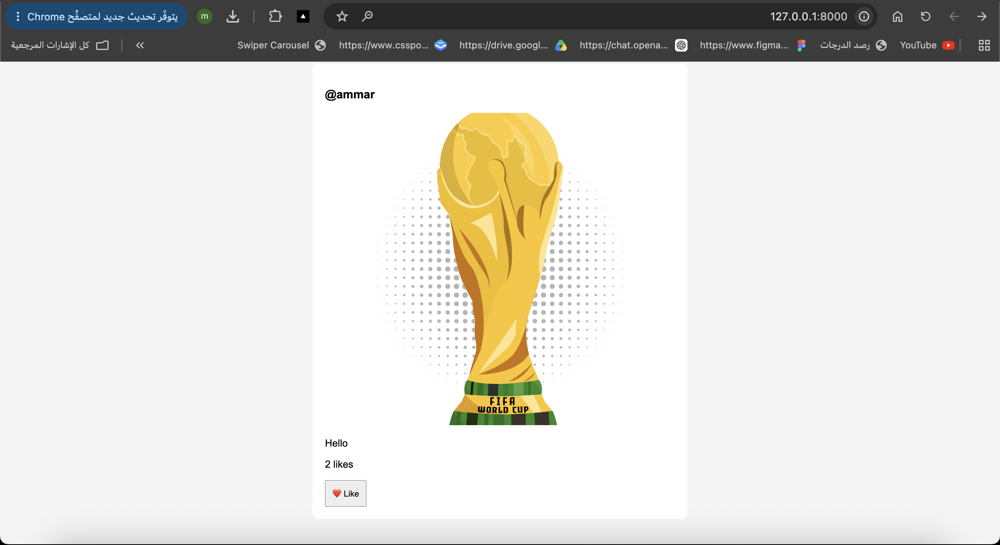

# Mini Instagram Clone

A simple Django project that demonstrates media uploads, image validation, database models, static files, and basic like functionality.

Users can create image posts by entering a username, description, and image. Uploaded images are stored inside `media/posts/`, while the post data is saved in the database.

The project only accepts image files with the following extensions:

- `.jpg`
- `.jpeg`
- `.png`

Each post displays the username, uploaded image, description, and number of likes.

If a post has no likes, the page displays:

`Be the first to like this`

When the Like button is clicked, the number of likes increases by 1 and is saved in the database.

## Features

- Create image posts
- Upload images using `multipart/form-data`
- Handle uploaded files using `request.FILES`
- Validate JPG, JPEG, and PNG files
- Save posts using a Django Model
- Store uploaded images inside `media/posts/`
- Display all posts on one feed page
- Like posts
- Show a different message when likes are 0
- Static styling using `static/css/feed.css`

## Post Model

Each post contains:

- Username
- Description
- Image
- Likes

## Static and Media

Static files are used for the site styling:

`static/css/feed.css`

Uploaded images are stored in:

`media/posts/`

## Screenshots

### Initial Feed



### After Uploading a Post


### After Liking the Post



## Run the Project

Install Pillow:

```bash
pip install Pillow