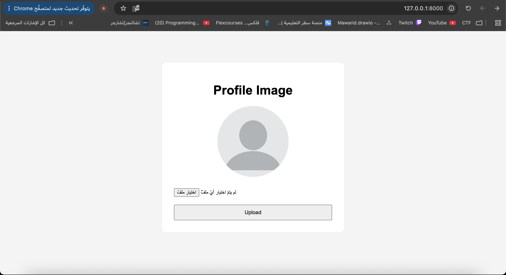
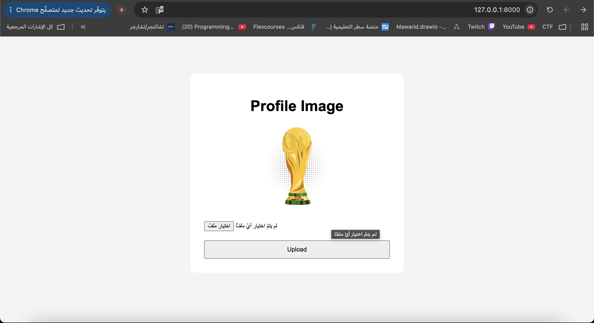

# Django Static and Media Upload

A simple Django project that demonstrates the difference between static files and media files.

The project uses a default profile image from the `static` folder, and users can upload a new profile image that is stored inside the `media` folder. The upload form uses `multipart/form-data`, and Django receives the uploaded file using `request.FILES`.

The project also uses `STATIC_URL`, `STATICFILES_DIRS`, and `STATIC_ROOT` for static files, and `MEDIA_URL` and `MEDIA_ROOT` for uploaded media files.

## Screenshots

### Default Photo


### Uploaded Photo


## Run

```bash
python manage.py runserver