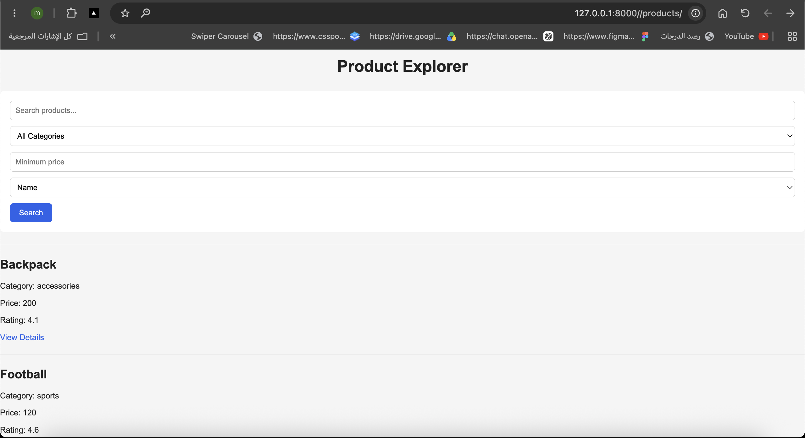
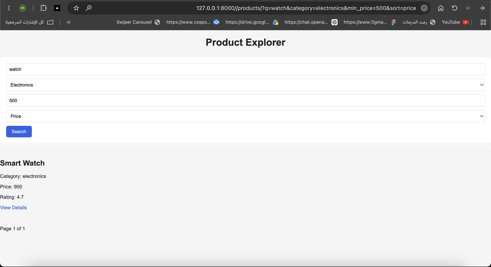
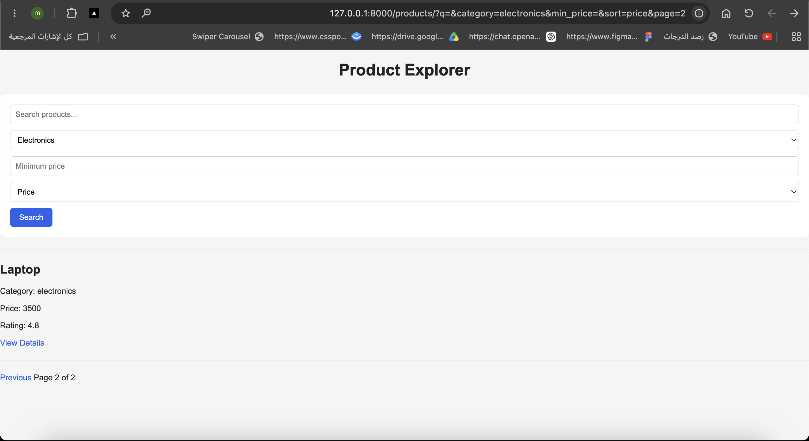
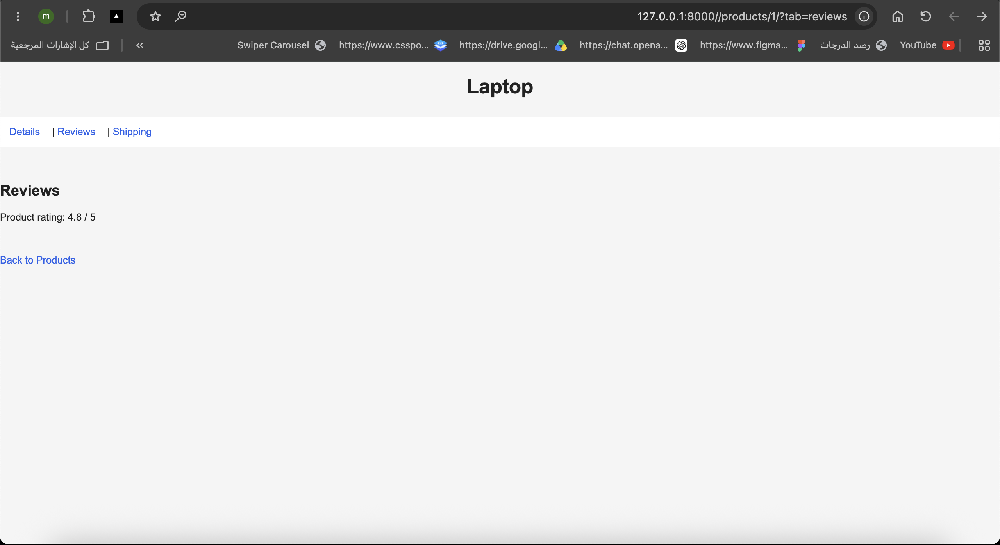
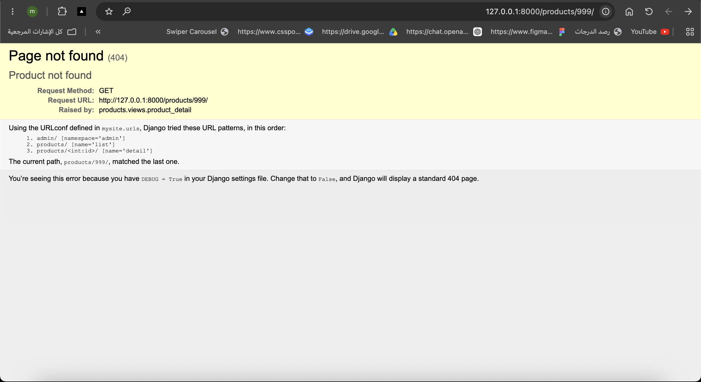

# Product Explorer

A simple Django Product Explorer project that demonstrates path parameters, query parameters, filtering, searching, sorting, pagination, tabs, and safe validation.

Users can search for products using `q`, filter by category and minimum price, and sort products by name, price, or rating. The project also preserves active query parameters when navigating between pagination pages.

Each product has a dynamic detail page using its ID. The detail page supports `details`, `reviews`, and `shipping` tabs using the `tab` query parameter. Invalid product IDs return a 404 page, and invalid query parameter values are handled safely.

## Screenshots

### Product List


### Search, Filter and Sort


### Pagination


### Product Detail Tab


### Invalid Product ID


## Run the Project

```bash
python manage.py runserver