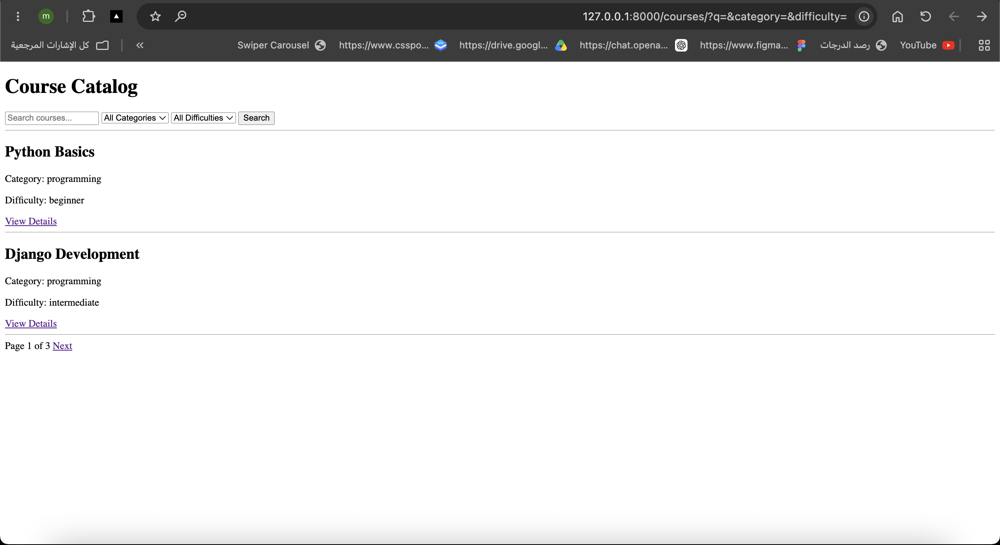
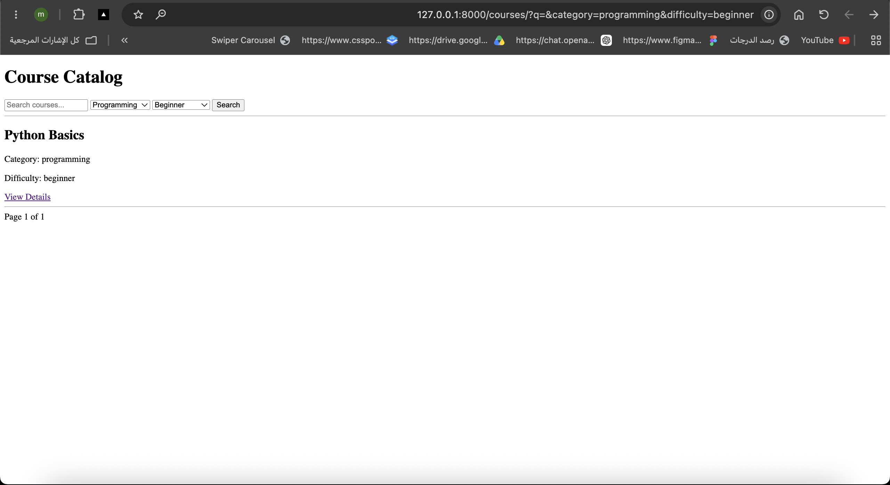
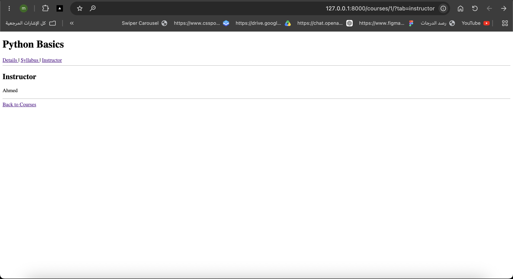

# Django Parameter-Aware Course Catalog

A simple Django project that demonstrates how to use query parameters with `request.GET` to control the content displayed on the page.

The project includes a course catalog with search, category filtering, difficulty filtering, pagination, course detail pages, and tabs. The tabs use query parameters such as `?tab=details`, `?tab=syllabus`, and `?tab=instructor` to display different content on the same course detail page.

The project also uses dynamic URLs for course details and handles missing query parameters using default values.

## Screenshots

### Home Page


### Filter Page


### Tab Page


## Run the Project

```bash
python manage.py runserver