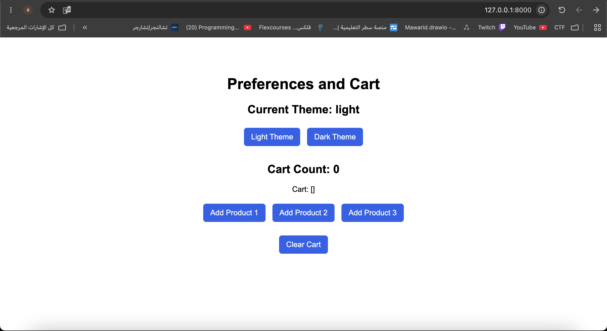
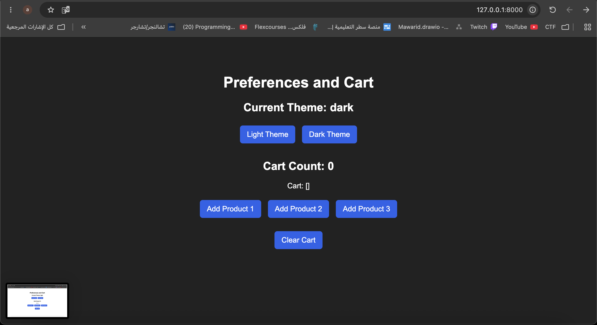
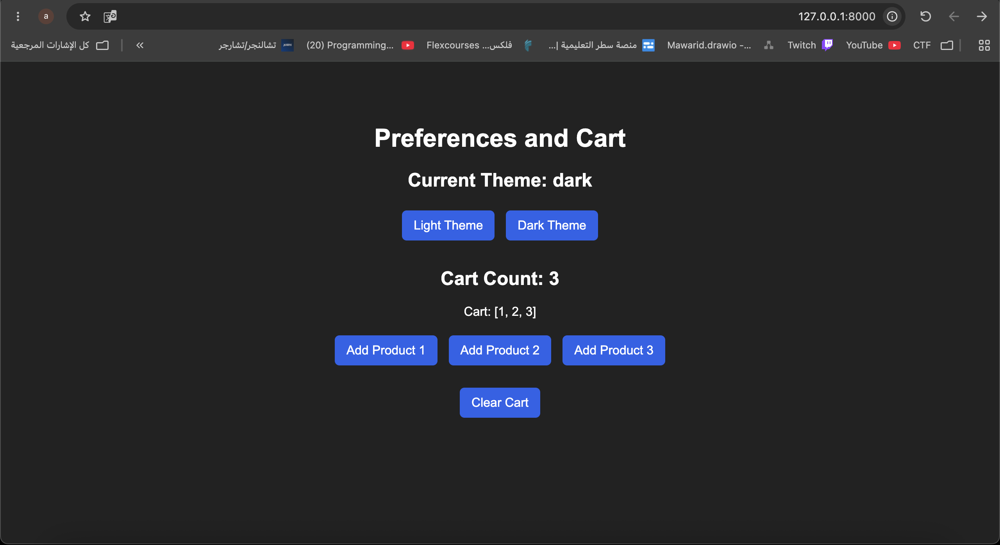

# Django Cookies and Sessions Lab

A simple Django project that demonstrates how Cookies and Sessions work.

The project allows the user to switch between Light and Dark themes. The selected theme is stored in a Cookie, so it remains selected after refreshing the page.

The project also includes a simple cart using Django Sessions. Products can be added to the cart, and the cart data remains available between requests. A Clear Cart option is also available to remove the cart data from the session.

## Screenshots

### Light Theme



### Dark Theme



### Cart with Products 1, 2 and 3



## Run the Project

```bash
python manage.py migrate
python manage.py runserver