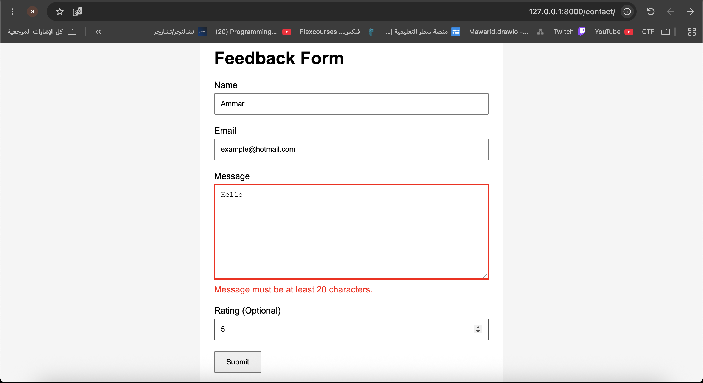
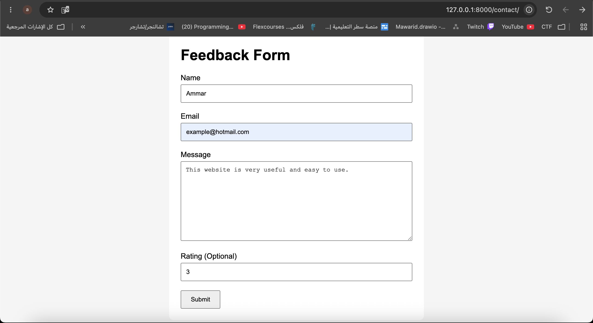
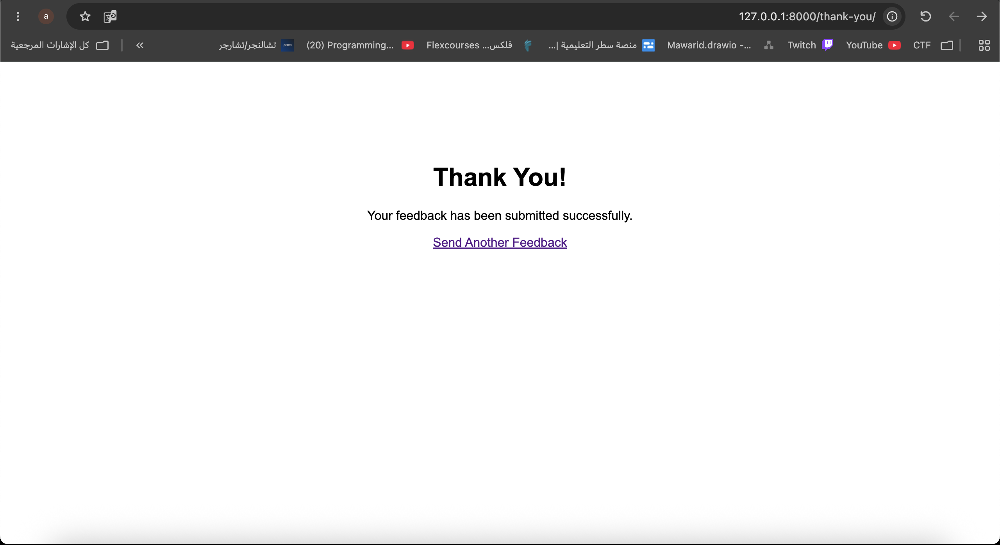

# Django Feedback Form

A simple Django project that demonstrates how to use Django Forms, form validation, error messages, and redirects.

The project includes a feedback form with name, email, message, and optional rating fields. The message must contain at least 20 characters. If the form contains invalid data, Django displays validation errors and highlights the invalid field. If the form is valid, the user is redirected to a Thank You page.

## Screenshots

### Invalid Form


### Valid Form


### Thank You Page


## Run the Project

```bash
python manage.py runserver