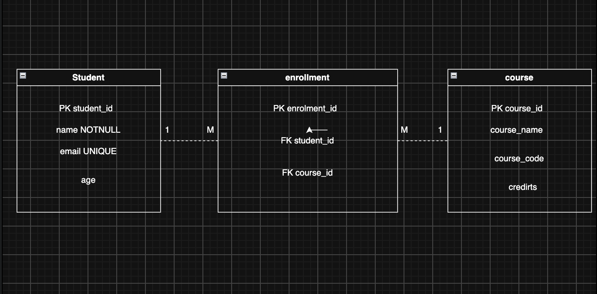

## Course Registration Database

### 1. Entities

The database has three main entities:

* Student
* Course
* Enrollment

### 2. Primary Keys

**Student**

* student_id → Primary Key

**Course**

* course_id → Primary Key

**Enrollment**

* enrollment_id → Primary Key

### 3. Student Attributes

* student_id
* name
* email
* age

### 4. Course Attributes

* course_id
* course_name
* course_code
* credits

### 5. Foreign Keys in Enrollment

The Enrollment table will have:

* student_id → Foreign Key referencing Student
* course_id → Foreign Key referencing Course

### 6. Relationships

**Student to Enrollment**

One Student can have many Enrollments.

**Relationship:** One-to-Many

```text
Student 1 -------- M Enrollment
```

**Course to Enrollment**

One Course can have many Enrollments.

**Relationship:** One-to-Many

```text
Course 1 -------- M Enrollment
```

This also means that Student and Course have a Many-to-Many relationship through the Enrollment table.

### 7. Constraints

**UNIQUE:**

The student's email should be unique because two students should not have the same email.

```text
email → UNIQUE
```

**NOT NULL:**

The student's name should not be empty.

```text
name → NOT NULL
```

### 8. Database Design

```text
Student
--------------------
student_id     PK
name           NOT NULL
email          UNIQUE
age
        |
        | 1
        |
        | M
Enrollment
--------------------
enrollment_id  PK
student_id     FK
course_id      FK
        |
        | M
        |
        | 1
Course
--------------------
course_id      PK
course_name
course_code
credits
```

## Exit Ticket

**Why should Enrollment not store the student name and course name repeatedly?**

Because the student name is already stored in the Student table and the course name is already stored in the Course table.

The Enrollment table only needs the `student_id` and `course_id` to connect them.

If we store the names again, the data will be repeated and this can cause data duplication and inconsistencies when the name changes.

