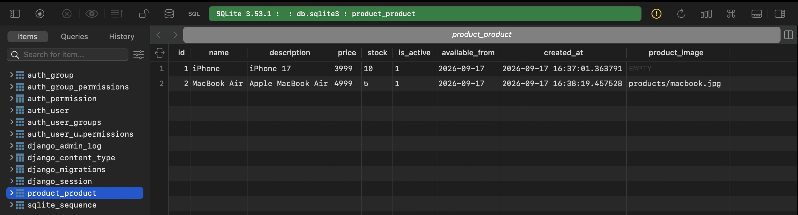

# Django Products

This is a simple Django project created to practice Django models, migrations, and database operations.

In this project, I created a `Product` model with different field types such as:

- `CharField`
- `TextField`
- `DecimalField`
- `PositiveIntegerField`
- `BooleanField`
- `DateField`
- `DateTimeField`
- `ImageField`

I also practiced:

- Creating and updating Django models
- Running `makemigrations` and `migrate`
- Creating model instances
- Saving data to the database
- Using the Django shell
- Viewing saved objects using Django ORM

## Product Model

The `Product` model contains:

- Name
- Description
- Price
- Stock
- Active status
- Available date
- Created date
- Product image

## Output

The following screenshot shows the result after creating and saving Product objects in the Django shell.

