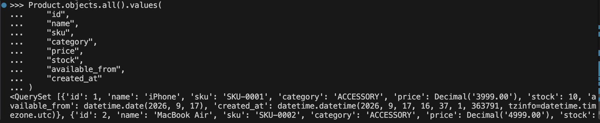

# Django Product Model

This is a simple Django project created to practice working with Django models, fields, migrations, and the database.

## Product Model

The `Product` model includes:

- Name
- Description
- Price
- Stock
- Active status
- Available date
- Created date
- Product image
- SKU
- Category

## What I Practiced

- Creating and updating a Django model
- Using different Django field types
- Using `blank=True` and `null=True`
- Adding `unique=True`
- Using `db_index=True`
- Creating choices with `TextChoices`
- Setting default values
- Running `makemigrations` and `migrate`
- Updating existing database records
- Viewing saved data using Django ORM

## Output

The following screenshot shows the saved product data from the Django shell.

